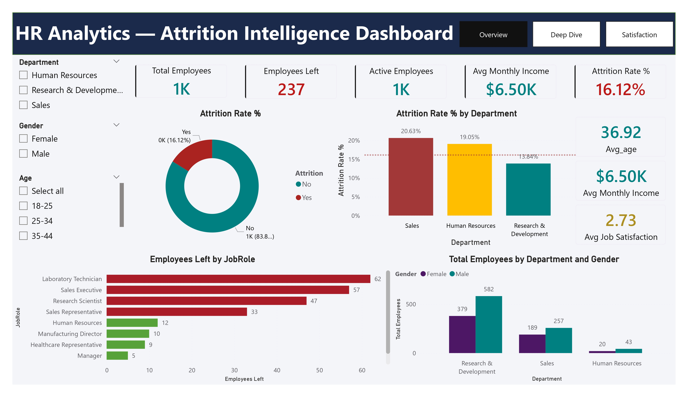
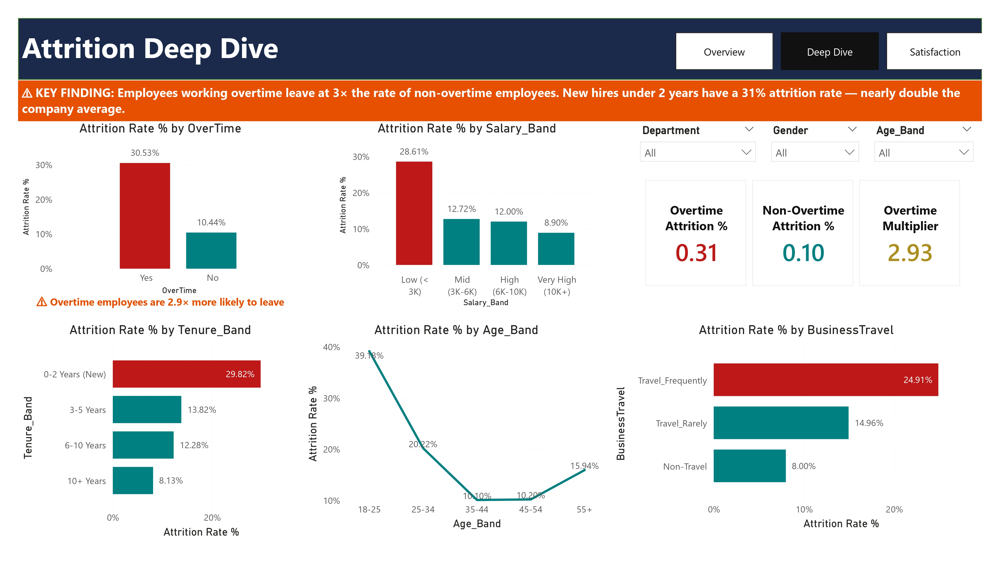
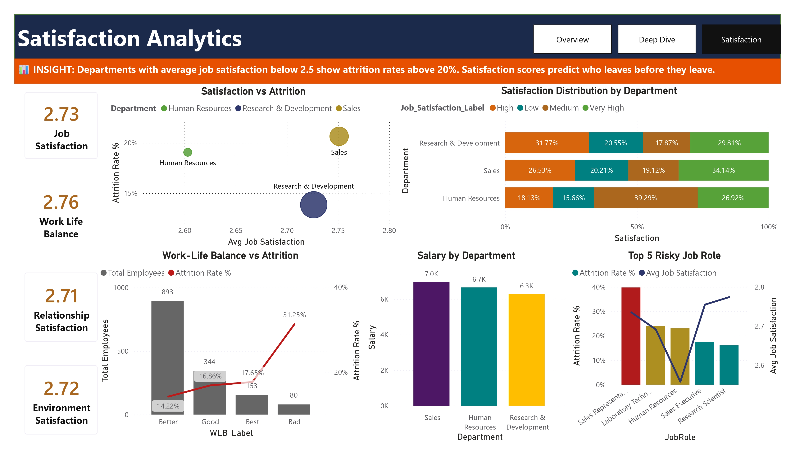

# HR Attrition Analytics Dashboard
### Microsoft Certified Data Analyst | Power BI · SQL Server · DAX

---

## The Business Problem

A company was losing 16.12% of its workforce annually with no 
clear understanding of why people were leaving or which groups 
were most at risk. HR decisions were reactive rather than 
preventive. This project identifies the root causes of attrition 
and quantifies the business impact of each driver.

---

## Key Findings

| Finding | Number |
|---|---|
| Overall Attrition Rate | 16.12% — 237 out of 1,470 employees left |
| Overtime is the #1 Driver | Overtime employees leave at 30.53% vs 10.44% — 2.93× higher |
| New Hire Risk | Employees with 0–2 years tenure leave at 29.82% |
| Low Salary Risk | Employees earning under $3K/month leave at 28.61% |
| Youngest Employees | 18–25 age band has the highest attrition at 39.18% |
| Travel Impact | Frequent travellers leave at 24.91% vs 8.00% for non-travellers |

---

## Dashboard Pages

**Page 1 — HR Overview**
Executive snapshot. KPI strip: Total Employees (1,470), 
Attrition Rate (16.12%), Active Employees (1,233), 
Employees Left (237), Avg Monthly Income ($6.50K).
Attrition by Department, Employees Left by Job Role, 
Gender breakdown by Department.

**Page 2 — Attrition Deep Dive**
The core analysis page. Overtime vs Non-Overtime attrition 
comparison (2.93× multiplier). Four driver charts: Age Band, 
Salary Band, Tenure Band, Business Travel. Key finding 
banner front and centre.

**Page 3 — Satisfaction Analysis**
Scatter chart: Job Satisfaction vs Attrition Rate by Department.
Work-Life Balance vs Attrition combo chart. Satisfaction 
distribution across departments. Top 5 highest-risk job roles 
by attrition rate and satisfaction score combined.

---

## Dashboard Screenshots

### Page 1 — Overview

### Page 2 — Attrition Deep Dive

### Page 3 — Satisfaction Analysis

---

## Workflow

Raw CSV Data
     ↓
Power Query — Cleaning, Age Band, Salary Band, Tenure Band
     ↓
SQL Server — Analytical queries, views created
     ↓
Power BI — Connected directly to SQL Server
     ↓
DAX — 13 custom measures
     ↓
3-Page Interactive Dashboard

---

## DAX Measures

Total Employees = 
COUNTROWS(vw_hr_main)

Employees Left = 
CALCULATE([Total Employees], vw_hr_main[Attrition] = "Yes")

Active Employees = 
CALCULATE([Total Employees], vw_hr_main[Attrition] = "No")

Attrition Rate % = 
DIVIDE([Employees Left], [Total Employees], 0) * 100

Overtime Attrition % = 
CALCULATE([Attrition Rate %], vw_hr_main[OverTime] = "Yes")

Non-Overtime Attrition % = 
CALCULATE([Attrition Rate %], vw_hr_main[OverTime] = "No")

Overtime Multiplier =
VAR OT = [Overtime Attrition %]
VAR NON = [Non-Overtime Attrition %]
RETURN IF(NON = 0, BLANK(), DIVIDE(OT, NON))

Avg Monthly Income = 
AVERAGE(vw_hr_main[MonthlyIncome])

Avg Job Satisfaction = 
AVERAGE(vw_hr_main[JobSatisfaction])

Avg Years at Company = 
AVERAGE(vw_hr_main[YearsAtCompany])

---

## Dataset

IBM HR Analytics Employee Attrition & Performance
Source: Kaggle
Records: 1,470 | Columns: 35 | Missing values: 0
Link: https://www.kaggle.com/datasets/pavansubhasht/ibm-hr-analytics-attrition-dataset

---

## Tools Used

- Power Query — Data cleaning and column creation
- SQL Server / SSMS — Analytical queries and views
- Power BI — 3-page interactive dashboard
- DAX — 13 custom measures

---

## About

- Built by Shaharier Shourov — Microsoft Certified Data Analyst
- Upwork: https://www.upwork.com/freelancers/shourov
- LinkedIn: www.linkedin.com/in/shaharier--shourov
